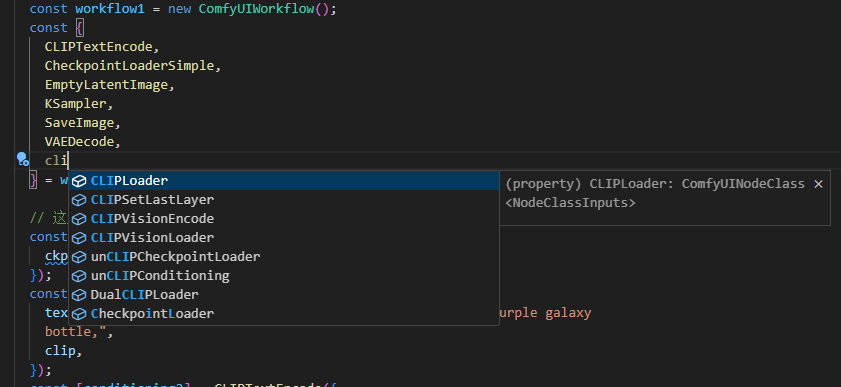

# @stable-canvas/comfyui-client

[](https://www.npmjs.com/package/@stable-canvas/comfyui-client)
[](https://www.npmjs.com/package/@stable-canvas/comfyui-client)
[](https://github.com/StableCanvas/comfyui-client)

Javascript api Client for [ComfyUI](https://github.com/comfyanonymous/ComfyUI) that supports both NodeJS and Browser environments.

This client provides comprehensive support for all available RESTful and WebSocket APIs, with built-in TypeScript typings for enhanced development experience. Additionally, it introduces a programmable workflow interface, making it easy to create and manage workflows in a human-readable format.

documentations:
- [Rest API](https://stablecanvas.github.io/comfyui-client/classes/ComfyUIApiClient.html)
- [WebSocket API](https://stablecanvas.github.io/comfyui-client/classes/ComfyUIWsClient.html)
- [Workflow API](https://stablecanvas.github.io/comfyui-client/classes/ComfyUIWorkflow.html)

examples:
- nodejs
  - [from client](examples\nodejs\src\main.ts)
  - [from workflow factory](examples\nodejs\src\main-wf.ts)
- [Web🚧](examples\web\index.html)

## Features

- **Environment Compatibility**: Seamlessly functions in both NodeJS and Browser environments.
- **Comprehensive API Support**: Provides full support for all available RESTful and WebSocket APIs.
- **TypeScript Typings**: Comes with built-in TypeScript support for type safety and better development experience.
- **Programmable Workflows**: Introduces a human-readable and highly customizable workflow interface inspired by [this issue](https://github.com/comfyanonymous/ComfyUI/issues/612) and [this library](https://github.com/Chaoses-Ib/ComfyScript).
- **Ease of Use**: Both implementation and usage are designed to be intuitive and user-friendly.

By incorporating these features, `@stable-canvas/comfyui-client` provides a robust and versatile solution for integrating ComfyUI capabilities into your projects effortlessly.

## Installation

Use npm or yarn to install the `@stable-canvas/comfyui-client` package.

```bash
pnpm add @stable-canvas/comfyui-client
```

## Usage

First, import the `ComfyUIApiClient` class from the package.

```javascript
import { ComfyUIApiClient } from "@stable-canvas/comfyui-client";
```

Client instance, in Browser
```js
const client = new ComfyUIApiClient({
    api_host: "127.0.0.1:8188",
})
// connect ws client
client.connect();
```
Client instance, in NodeJs
```js
import WebSocket from "ws";
import fetch from "node-fetch";

const client = new ComfyUIApiClient({
    //...
    WebSocket,
    fetch,
});
// connect ws client
client.connect();
```
Execute prompt
```javascript
// Define the prompt and optional workflow
let prompt = { /* prompt details */ };
let workflow = { /* workflow details */ };

// Execute the prompt
const result = await client.runPrompt(prompt, { workflow });
console.log(result); // { images: [...] }
```

## Programmable calls
Inspired by [this issue](https://github.com/comfyanonymous/ComfyUI/issues/612) and [this library](https://github.com/Chaoses-Ib/ComfyScript), this library provides a programmable workflow interface.

Both implementation and usage are extremely simple and human-readable. Below is a simple example of creating a workflow:

```ts
const createWorkflow = () => {
  const workflow = new ComfyUIWorkflow();
  const {
    KSampler,
    CheckpointLoaderSimple,
    EmptyLatentImage,
    CLIPTextEncode,
    VAEDecode,
    SaveImage,
  } = workflow.classes;

  const [model, clip, vae] = CheckpointLoaderSimple({
    ckpt_name: "lofi_v5.baked.fp16.safetensors",
  });
  const [latent_image] = EmptyLatentImage({
    width: 512,
    height: 768,
    batch_size: 1,
  });
  const [positive_conditioning] = CLIPTextEncode({
    text: "best quality, 1girl",
    clip,
  });
  const [negative_conditioning] = CLIPTextEncode({
    text: "text,error,username,fake,drawing,painting,worst quality, bad anatomy, embedding:NG_DeepNegative_V1_75T",
    clip,
  });

  const [samples] = KSampler({
    seed: Math.floor(Math.random() * 2 ** 32),
    steps: 35,
    cfg: 4,
    sampler_name: "dpmpp_2m_sde_gpu",
    scheduler: "karras",
    denoise: 1,
    model,
    positive: positive_conditioning,
    negative: negative_conditioning,
    latent_image,
  });

  const [image] = VAEDecode({
    samples,
    vae,
  });

  SaveImage({
    filename_prefix: "from-sc-comfy-ui-client",
    images: image,
  });

  return workflow;
};

const wf1 = createWorkflow();
// { prompt: {...}, workflow: {...} }
```

And it comes with type hints



### Invoke workflow
```ts
const wf1 = createWorkflow();
const result = await wf1.invoke(client);
```

## Contributing

Contributions are welcome! Please feel free to submit a pull request.

## License

MIT